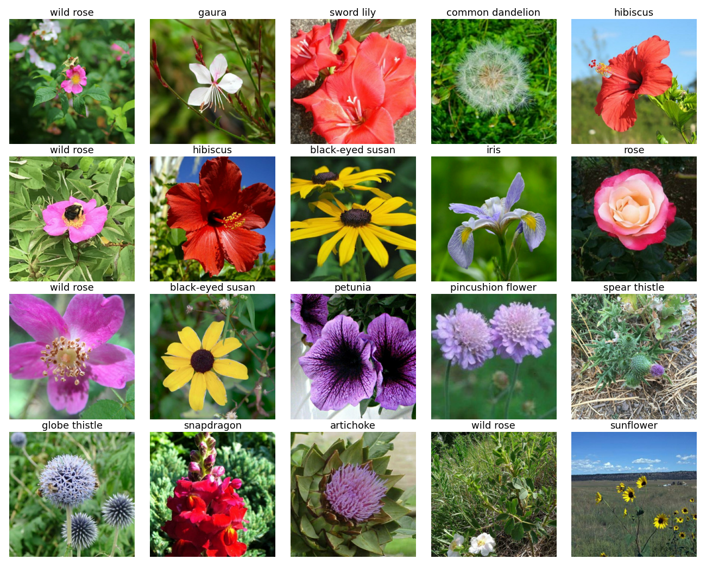

# Flower Classification

## Team

Our team name is **BackpropagationBrigade**.

Team members:

| Name                  | Neptun code |
| --------------------- | ----------- |
| Háhn Nikoletta Hedvig | N2FGBL      |
| Skáre Erik            | Z7ZF6D      |
| Szommer Zsombor       | MM5NOT      |

## Big homework - Milestone 1.

### Identify data source and download scripts.

We are doing the [Flower Classification](https://www.kaggle.com/competitions/tpu-getting-started) Kaggle competition.

The `get_data.sh` script is used to retrieve the data, but it requires a valid Kaggle token located at `~/.kaggle/kaggle.json`.

### Data exploration, visualization (if necessary).

### Preparing data for train, final output: train, validation and test inputs and outputs.

Running `python src/main.py` performs data loading and preparation for train.

### Open in Google Colab

## Big homework - Milestone 2.

## Create virtual environment 

To create virtual environment running create_environment.sh that call requirements.txt to install necessary package. 

### Identify data source and download scripts.

We are doing the [Flower Classification](https://www.kaggle.com/competitions/tpu-getting-started) Kaggle competition.

### Data exploration, visualization (if necessary).

### Preparing data for train, final output: train, validation and test inputs and outputs.

Running   `python trainer/tanitas.ipynb` performs data loading and preparation for train and visualization for the outputs. 

